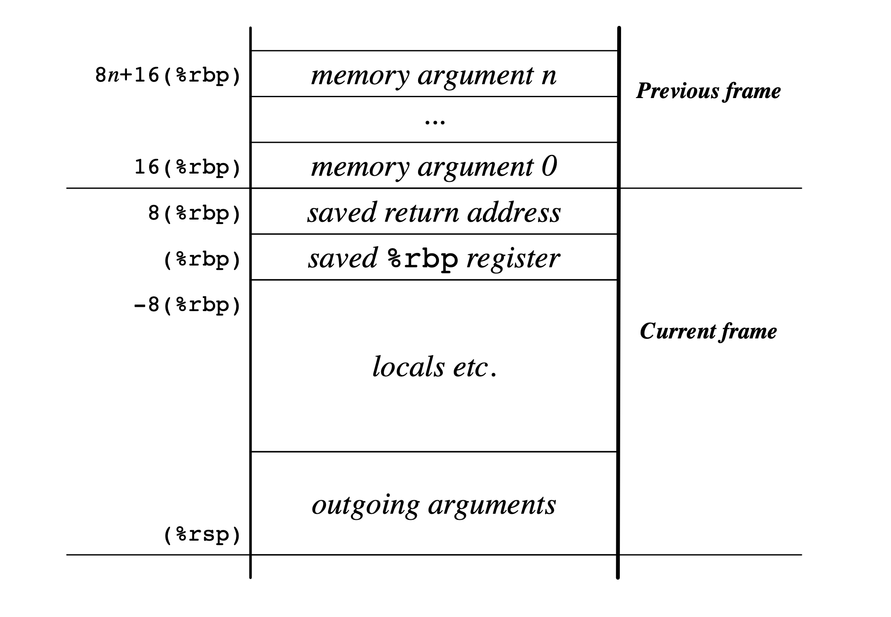

# LLVM Backend

可以参考 艮鮟鱇 さんのメモ　里面详细介绍了各种参考资料的优缺点，还有 LLVM 的整个 Backend 框架，也有实战的 ISA 代码，而且也不难读。

- [virtualsecureplatform/llvm-cahp (github.com)](https://github.com/virtualsecureplatform/llvm-cahp)
- [【下書き】 LLVMバックエンド開発文書 for CAHPv3 (ushitora-anqou.github.io)](https://ushitora-anqou.github.io/write-your-llvm-backend/draft-cahpv3.html)

---

make llvm backend

[Backend structure — Tutorial: Creating an LLVM Backend for the Cpu0 Architecture (jonathan2251.github.io)](https://jonathan2251.github.io/lbd/backendstructure.html)

---

Anothor fine one by Vassil Vassilev 

[interpreter/llvm/src/docs/WritingAnLLVMBackend.rst · 9e104ac7900ca264066d57aac1655ac1d8daf5f0 · ERS / root · GitLab (desy.de)](https://gitlab.zeuthen.desy.de/ers/root/-/blob/9e104ac7900ca264066d57aac1655ac1d8daf5f0/interpreter/llvm/src/docs/WritingAnLLVMBackend.rst)

---

[what is stack frame lowering in llvm? - Stack Overflow](https://stackoverflow.com/questions/32872946/what-is-stack-frame-lowering-in-llvm)

---

[Stack Frames. Red Zone, Prologue and Epilogue on x86-64, demystified. Demo on the GNU Debugger. - YouTube](https://www.youtube.com/watch?v=-52uAgw60yM)

---

[handout-03.pdf (uchicago.edu)](https://www.classes.cs.uchicago.edu/archive/2009/spring/22620-1/docs/handout-03.pdf)

> 3.3 Procedure-calling protocol
>
> 
>
>  // Case 3: In the case of dynamic allocas and stack realignment, **RSP is used**
>
>  **// to address stack arguments for outgoing calls and nothing else**. The "base
>
>   // pointer" points to local variables, and RBP points to fixed objects.

---

